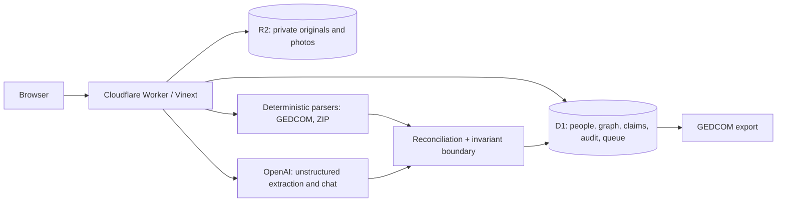

# Darabiha launch kit

Updated: 2026-09-01

## One sentence

Darabiha is an AI family archivist that turns the documents, old websites, GEDCOM files, photographs, and corrections a family already has into a source-backed, editable, portable family history.

## Hacker News draft

**Title:** Show HN: I turned my father’s 25-year-old family-tree website into an agentic archive

My father built a family tree as dozens of HTML files nested by generation. The relationships were implicit in links and folder structure, names were repeated, cousins married cousins, and importing it into a normal genealogy product would have meant cleaning it by hand first.

I built Darabiha to ingest that material as evidence rather than as a clean database. It recursively reads folders and ZIPs, parses GEDCOM deterministically, extracts facts from unstructured files, reconciles likely duplicates, preserves contradictory claims, and asks the family only when a conflict is materially ambiguous. Every mutation is audited. Ordinary edits, person deletion, and duplicate merges can be undone. The archive exports deterministic GEDCOM 5.5.1 so the data is not trapped here.

The UI is a pan-and-zoom family canvas with conventional spouse and parent/child connectors, person records, sources, stories, photos, fill-in questions, maps, timelines, and chat CRUD. The difficult parts were not drawing nodes; they were identity resolution, preserving provenance, keeping old data from blocking new contributions, and making Safari pointer behavior reliable.

Privacy is deliberately conservative: evidence files are editor-only, public views redact details/photos/stories for likely living people, public AI sees only the redacted graph, and public AI/password attempts are rate-limited. The sample at `/demo` is entirely synthetic and runs in memory.

Stack: React/Next-compatible Vinext on Cloudflare Workers, D1, R2, OpenAI Responses API, Vitest, Playwright, and Remotion. Current automated gate: 38 test files / 179 tests, lint with six known image-optimization warnings, and a production build. The remaining limitation is that the hosted deployment is one family archive, not yet a multi-tenant genealogy SaaS.

I’d especially value feedback on the evidence model, GEDCOM edge cases, and how much adjudication an archivist agent should do automatically.

Links: product, safe demo, architecture/privacy, source repository, 15-second demo.

## Product Hunt listing

**Name:** Darabiha

**Tagline:** Turn messy family material into a living, trustworthy archive.

**Short description:** Upload old websites, folders, ZIPs, GEDCOM, documents, and photographs. The family archivist extracts people and relationships, reconciles duplicates, preserves sources and uncertainty, asks only when a conflict needs a human, and lets the family edit or undo everything in chat.

**First comment:**

Darabiha began with a real problem: my father had already done years of family-history work, but it lived in a maze of hand-built HTML pages. Starting over in a blank genealogy app would have discarded the structure and context he had already recorded.

So I built an archivist, not just a tree editor. It accepts the archive a family actually has, turns claims into inspectable records, handles clear overlap itself, and raises the hard ambiguities for the family. The result is still portable GEDCOM, and the family—not the model—owns the evidence and final record.

The launch demo uses invented people. No real living-relative data is required to understand the product.

## Gallery sequence

Avoid five static tree screenshots. Use this sequence:

1. A nested legacy folder/ZIP entering the composer.
2. Cards and conventional family connectors moving under a pan/zoom gesture.
3. A source-backed museum-style person record opening in the sidebar.
4. A duplicate merge or disputed claim, followed by one-step Undo.
5. GEDCOM export, History, and the private evidence room.

## Fifteen-second demo script

- 0–2s: drop `sample-family.ged` / nested archive into the archivist.
- 2–6s: camera pans across newly arranged generations while connectors animate into view.
- 6–9s: zoom into one highlighted card and open its source-backed profile.
- 9–12s: show “Merged duplicate” in chat/History, then press Undo.
- 12–15s: zoom back to the complete tree; end card: “Your family already has an archive. Darabiha helps it make sense.”

## Architecture and trust boundary

- Structured GEDCOM is parsed before any model call.
- Unstructured inputs sent to OpenAI include only the context required for the requested extraction.
- Every accepted fact records source type, label, optional attachment/locator/excerpt, confidence, creator, and timestamps.
- Contradictory claims coexist; choosing a preferred claim is audited.
- Public anonymous readers receive a living-person-redacted tree, and public AI sees that same redacted tree.
- Original documents are private to editors. The safe demo uses no server persistence.

## Measured verification record

Run on 2026-09-01 after the launch-readiness work:

- `npm test`: 38 files, 179 tests passed.
- `npm run lint`: 0 errors; 6 known `no-img-element` warnings for authenticated/R2 archive images.
- `npm run build`: production build passed; 29 routes classified/built including `/demo`.
- Deterministic GEDCOM fixture: people, family, spouse, parent, event, place, residence, notes, qualified-date preservation, and exporter round trip.
- Mutation fixture: exact restoration across people, relationships, stories, photographs, comments, members, questions, and evidence claims.

## Launch-day checklist

- [ ] Increment the visible build version and deploy the exact `main` commit.
- [ ] Verify `/api/version` returns that version and commit.
- [ ] Verify `/demo`, Privacy, Terms, GEDCOM export, Documents, History, and source links in production.
- [ ] Run desktop Chromium, Firefox, WebKit, and mobile browser suites.
- [ ] Perform physical Safari/macOS pointer, trackpad pan/zoom, card click, branch hide/show, and version checks; record them in `docs/HANDOFF.md`.
- [ ] Confirm the public archive visibility choice and consent for anything exposed outside the synthetic demo.
- [ ] Render the 15-second Remotion clip and capture five distinct gallery frames.
- [ ] Post HN first; answer technical/privacy questions with the architecture and limitations above.
- [ ] Incorporate HN feedback, then schedule Product Hunt with the final video and maker comment.

## Honest limitations

- The deployed instance is one family archive. Per-family workspace isolation and self-serve archive creation are not shipped yet.
- GEDCOM custom extensions, rich media/source structures, adoption, and every jurisdiction-specific genealogy convention are not fully modeled.
- Very large archive reads resume at the document boundary, not at an arbitrary entry inside one compressed file.
- Automatic identity reconciliation remains intentionally conservative.
